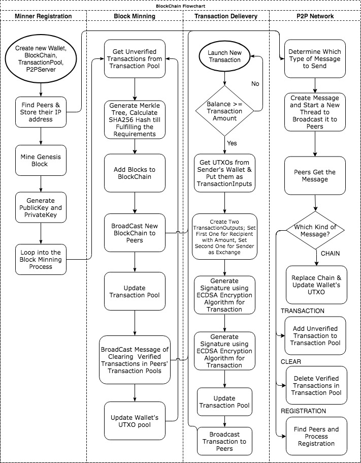

# General
Basiclly, this project aim to build a blockchain from scratch. Things covered are shown below:

1. Create the core blockchain
2. build APIs around the blockchain
3. Create a dynamic peer-to-peer server for multiple contributors
4. Implement a proof-of-work system to balance users. 

## Workflow

# Blockchain
Distributed and decentralized ledger that stores data like transactions, that is publicly shared across all the nodes of its network. 

## Crytocurrency
It contains three parts, blockchain, mining and wallet. 
### Blockchain
With hash and last hash, we connect each block, and make the connection stable.
### Mining
Add transactions to the blockchain, need to be confirmed, solving a proof of work algorithm. Once one miner solve, broadcast it to others, miner can add this block and other miners will verify. 
Changable difficulty can adjust to control the rate of new bl;ocks coming in. 
### Wallet
Store the private and public key of an individual
Public key is the address of the wallet. 

# Some Explanations

## multi-miners
Miners may want to add some blocks to the blockchain at the same time. There are 2 mechanisms to make the judgement.

1. Choose the longest one
2. Check if the data has been changed/tampered

## P2P networking

To truly support multiple miners to run this blockchain application together. Use websocket to do so. The first app wiil start the peer to peer server, and the laters will connect to the original one. 

    npm run dev
    HTTP_PORT=3002 P2P_PORT=5002 PEERS=ws://localhost:5001 npm run dev

Use this two commands to imitate p2p. 

## Proof of work
A system requiring miners to do computational work to add blocks. Cause any peer have the ability to replace the blockchain with their own. Proof of work make it unproductive to tamper data and make the broadcast. 

### The system: Hashcash
Have a limit for the hash value, like the value need to have several leading zeros, or we need to do the rehash. It controls the time needed to generate a new block. For to generate a new hash value, we import `nonce`, which will increase itself by one per rotation. Also we need to set the difficulty of mining, thus the generation time of a new block can be consistent.

Import a new variable `Mine rate`, the mechanism works in this way: compute the time consumed for generating a new block, if it's less than mine rate, difficulty ++; otherwise, difficulty --. 

## Cryptocurrencies
1. Contain wallet objects
2. Keys for digital signatures and verification
3. Have transaction objects to represent currency exchange
### Wallet
Tied to transactions, core object of the crytocurrency with three component.
1. Store the balance of an individual
2. Store an individual's keys (digital signature)
#### private key
allow individual to generate unique digital signatures. 
#### public key
allow other individuals in the blockchain network to verify digital signatures generated by the wallet's public key. 

3. public address
identical to the wallet's public key

### Transactions
Signature contains of private key and data. Ultimately, we will offer a system where multiple users are submitting transactions to a collection, and miners on the blockchain network will take a chunk of transactions in a collection and include it as data for the blockchain. Only include valid transactions ---> verify signature. 
#### Input
Contains details of the sender
#### Outputs
How much currency the sender is giving to other wallets
#### Unique ID
To identify the transaction object 

#### Transaction Pool
constains all new transactions submitted by individuals.Those new transactions are seen as unconfirmed because they have not been officially included within the block chain. And miners will do the job of creating blocks that confirm transactions, and include them as data for a new block in the blockchain. 

Transaction Pool is located locally, same like blockchain infomation. Thus we need to use p2pServer to do the sychronization. 

**Miners**  will take transactions from transaction pool and store them as data in blockchain. They do the computational work of discovering a block in the blockchain and store transactions into the chain. Transaction go from unconfirmed state to confiremed, from transaction pool to blockchain. 

**Miner reward** 
That's the incentive for miners to the the computational work. 
For the reward, basically, it's a transaction, but it has several differences.

1. *Only one output* Only need reward amount
2. *Blockchain* itself sign the transaction

### Recalculate the balance
Need to update the balance before each transactions.
Use all the outputs from the most recent transaction to get rid of double counting. 
